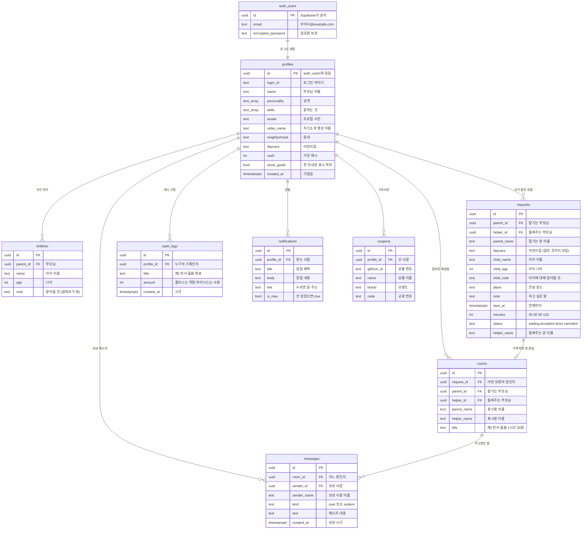
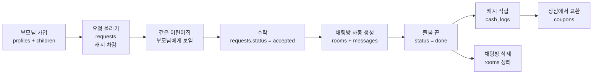

# 돌봐줘 — 데이터베이스 구조 (ERD)

Supabase(PostgreSQL)에 만든 표 8개와 서로의 관계입니다.

- `PK` = 각 줄을 구분하는 고유 번호
- `FK` = 다른 표를 가리키는 연결 고리
- `||--o{` = 하나가 여러 개를 가진다는 뜻 (예: 부모 1명 ↔ 아이 여러 명)

## 한눈에 보는 흐름

## 누가 무엇을 볼 수 있나 (보안 규칙 · RLS)

| 표 | 볼 수 있는 사람 | 이유 |
|---|---|---|
| `profiles` | 로그인한 모두 | 이웃을 찾아야 하므로 |
| `requests` | 로그인한 모두 | 동네에 요청이 공유돼야 하므로 |
| `children` | **본인만** | 아이 정보는 민감 |
| `rooms` · `messages` | **참여자만** | 남의 대화는 못 봄 |
| `cash_logs` · `notifications` · `coupons` | **본인만** | 개인 기록 |

> 비밀번호는 어느 표에도 없습니다. Supabase의 `auth.users`가 암호화해서 따로 보관합니다.
